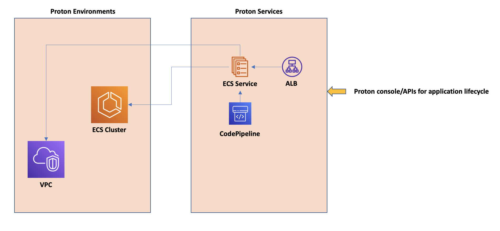

### Introduction to Proton

#### What is Proton?
Proton is a fully managed AWS service that helps engineering platform teams to build developer portals to streamline the SDLC (software development lifecycle). Proton has two main goals: increase developers' productivity and agility while allowing organizations to maintain the right level of control and governance. 

#### Who are the Proton users? 
Proton has two main actors:
- the platform admin: responsible for authoring application templates and everything in the DevOps spectrum that aims at removing undifferentiated heavy lifting for the developer
- the developer: responsible for writing application code and deploying it using the platform abstractions and artifacts made available by the platform admin
> These two actors are mapped to two AWS managed IAM policies: `AWSProtonFullAccess` and `AWSProtonDeveloperAccess` (there is also a `AWSProtonReadOnlyAccess`).

#### Why would you use Proton?  
There are two set of reasons why customers find Proton useful. They are grouped by users profiles. Usually the larger the organization is the most value they can extract from the product.  

Platform admins use Proton because they can: 
- create standard and versioned templates to better support their developers 
- create guard-rails in the SDLC that guarantee governance and compliance 
- have a consolidated view of the stacks deployed and their version across AWS accounts
- and more... 

Developers use Proton because they can:
- deploy their application in self-service 
- deploy their applications without being experts in AWS services
- avoid to reinvent the wheel and re-use best practices (for security, availability, cost optimization) codified by the platform teams in the templates 
- and more... 

#### Is Proton a service catalog product? 
While Proton could act as a generic multi-purpose service catalog, Proton really shines in the context of application delivery because it's SDLC-aware (for lack of a better description). Proton works with 3 mains objects: 

- `Environments`: they represent shared infrastructure components that multiple services can potentially consume. Environments (templates) are defined by platform admins and are (typically) deployed by the platform admins. Think of VPCs, clusters, databases and so forth. 
- `Services`: they represent application infrastructure components that embed the best practices developers can leverage. Services (templates) are defined by platform admins and are deployed by the developers. Think of Fargate services, Lambdas and so forth. 
- `Pipelines`: they represent, well ... pipelines. Similarly to services, pipeline (templates) are defined by platform admins and are deployed by the developers along with the service. Pipelines are an optional object and the developer is allowed to "bring their own" pipeline if so they wish. 

What set Proton aside from a generic multi-purpose service catalog is that these objects are tied and aware of each others. For example, the pipelines (when included) are tied to specific services. Also, the service templates are declared compatible with specific environment templates so that when a developer deploys a specific service Proton allows the deployment only to envirinments that are compatible with that service.   

This is a simplistic visua representation of these objects: 

