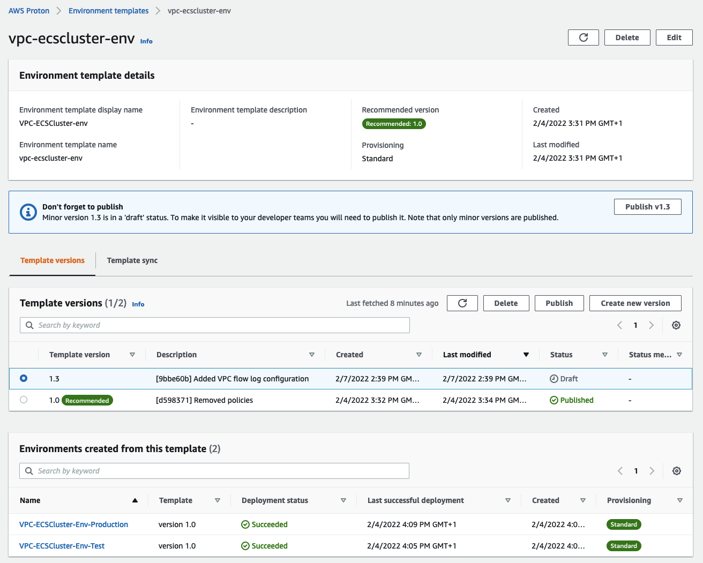
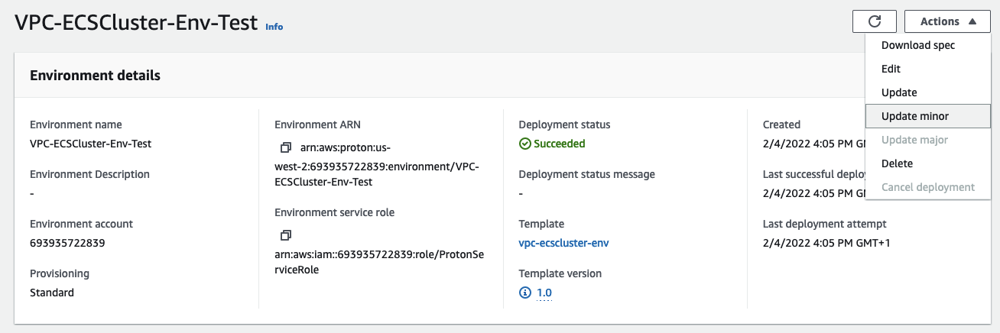

### Maintaining templates and deployments in Proton  

In the previous chapter we discovered how a Proton admin could import templates and how Proton admin and developers can deploy environments and services. This is table stake for Proton but not where Proton shines. You start appreciating the value of Proton when you start considering how admins can maintain the deployments for day2 operations. This is what we will explore in this chapter. 

### Updating the environment template [ PLATFORM ADMIN ]

Let's say the platform administrator team has a new standard for VPC deployments that require enabling `VPC flow log`. This was not enabled in the original environment templates. 

Open the CloudFormation template that represent the environment infrastructure and add the following YAML code right after the VPC and subnets definition: 

```
  VPCFlowLog:
    Type: AWS::EC2::FlowLog
    Properties:
      DeliverLogsPermissionArn: !GetAtt FlowLogRole.Arn
      LogGroupName: FlowLogsGroup
      ResourceId: !Ref VPC
      ResourceType: VPC
      TrafficType: ALL
  FlowLogRole:
    Type: AWS::IAM::Role
    Properties:
      AssumeRolePolicyDocument:
        Statement:
        - Effect: Allow
          Principal:
            Service: [ec2.amazonaws.com]
          Action: ['sts:AssumeRole']
      Path: /
      ManagedPolicyArns:
        - 'arn:aws:iam::aws:policy/CloudWatchLogsFullAccess'
  FlowLogsGroup: 
    Type: AWS::Logs::LogGroup
    Properties: 
      RetentionInDays: 7
```

This will create a CloudWatch LogGroup and will configure the VPC to use it. Because this is not a breaking change to the VPC configuration we will update the template in the `v1` folder (this will result in a so called `minor version` change). Commit the change to the repository. 

Because we have imported the template using `Git Sync`, Proton will discover the change in the template and will propose it as a `Draft`: 



> Note that each commit that modifies the template will automatically increase the minor version by one. In this case I made a few commits but I deleted the first two minor versions so Proton presents me version `1.3`. If this is your first commit you should see version `1.1` 

Go ahead and `Publish` the draft. Your `recommended` version should become `1.3`.

Note in the same environment template page you can see all environments (and their version) that have been originated from this template. This provides a good mechanism to track your deployments. 


### Updating the environments [ PLATFORM ADMIN ]

If you return to your `test` environment you will notice that under `Template version` it says `1.0` with a small information icon. If you expand that it will say that `you are not using the latest minor version.` 

You can then go ahead and `Update minor` (without changing anything in the wizard): 



At the end of this process the `Template version` should report the latest minor version and it should have a `recommended` green next to it (to remind the user that it's the latest available). If you are curious, in the EC2 console you can explore the two VPC and note that one (the `test` VPC) has the `Flow log` configuration filled properly while the other does not. 

You  Congratulations, you have just updated your first Proton environment by adding VPC flow log support. Go ahead and update the `production VPC as well`. 

### Updating the service template [ PLATFORM ADMIN ]

Now that we have updated both the environment template and the environments themselves, let's explore updating the services. Let's assume we want to bring two changes to our service: 
- we want to enable ECS exec so that developers can ECS exec into the tasks (for debugging purposes) 
- we want to add a manual approval to the latest stage of the pipeline before deploying to production 
